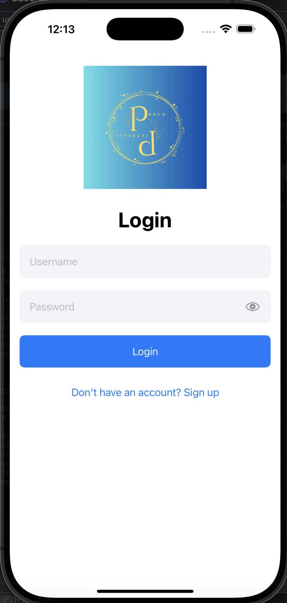
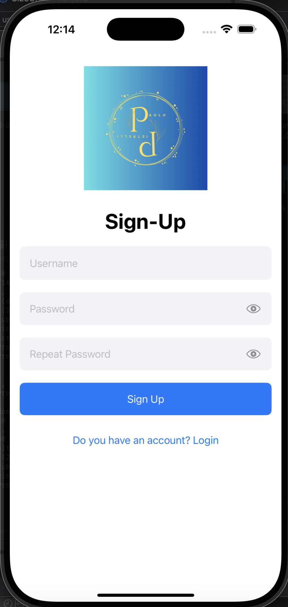

# EasyLogin

EasyLogin is an iOS application built with SwiftUI that provides a simple login and registration interface. This project demonstrates fundamental concepts in SwiftUI and the MVVM architecture, including form validation, conditional navigation, and state management.

## Features

- **Login Screen:**  
  Users can enter their username and password to authenticate.

- **Registration Screen:**  
  New users can sign up by providing a username, password, and password confirmation.

- **Password Visibility Toggle:**  
  Users can toggle password visibility with an eye icon.

- **MVVM Architecture:**  
  The app uses the Model-View-ViewModel pattern to separate UI from business logic.

- **Responsive UI:**  
  The UI adapts to various screen sizes and orientations using SwiftUI's layout features.

- **Conditional Navigation:**  
  Successful login displays a confirmation popup and navigates to the Home screen.

## Screenshots

Screenshots for the Login and Registration screens are available below.




## Requirements

- iOS 16.0+
- Xcode 14+
- Swift 5

## Installation

1. **Clone the repository:**

   ```bash
   git clone <repository-url>
